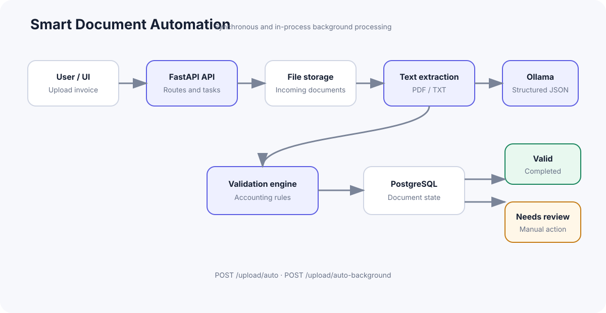

# Smart Document Automation

An end-to-end intelligent document processing pipeline designed to parse, extract, and validate unstructured documents (e.g., invoices) into structured data with €0 cloud costs using local AI models.

---

## ✨ Key Features

- Automated PDF/TXT invoice processing
- Local LLM extraction with Ollama and Llama 3.2
- Structured Pydantic outputs
- Deterministic accounting validation
- Human-in-the-loop review workflow
- Background document processing
- PostgreSQL persistence
- Dockerized local environment
- Automated API and validation tests
- €0 cloud/API cost when run locally

---

## ✅ Project Status

**Smart Document Automation v1.0 — Complete**

The v1.0 release includes the end-to-end invoice pipeline, local LLM extraction, deterministic validation, human review workflows, background processing, a browser interface, automated tests, Docker support, and portfolio documentation.

The current release is intended for local development and demonstration. Production deployment would require authentication, HTTPS, rate limiting, database migrations, malware scanning, and managed secret storage.

---

## 🏗️ Architecture & Pipeline

```text
                    ┌──────────────────┐
                    │  User / Operator │
                    └────────┬─────────┘
                             │
                        Upload document (POST /upload/)
                             │
                             ▼
                    ┌──────────────────┐
                    │   FastAPI API    │
                    └────────┬─────────┘
                             │
                             ▼
                    ┌──────────────────┐
                    │ Document Storage │ (storage/incoming)
                    └────────┬─────────┘
                             │
                             ▼
                    ┌──────────────────┐
                    │ Document         │ (POST /documents/{id}/process)
                    │ Processing (PDF) │
                    └────────┬─────────┘
                             │
                             ▼
                    ┌──────────────────┐
                    │ AI Extraction    │ (POST /documents/{id}/extract)
                    │ / Parser (Ollama)│
                    └────────┬─────────┘
                             │
                             ▼
                    ┌──────────────────┐
                    │ Validation       │ (POST /documents/{id}/validate)
                    │ Business Rules   │
                    └────────┬─────────┘
                             │
                    ┌────────┴─────────┐
                    ▼                  ▼
              Valid document     Needs review
           (status: "valid")  (status: "needs_review")
                    │                  │
                    ▼                  ▼
                    PostgreSQL          Review Queue
```

## 🔄 Processing Flows



The background endpoint uses FastAPI `BackgroundTasks` for lightweight in-process asynchronous work. This project does not use Celery, Redis, or a distributed worker system.

---

## 🚀 Tech Stack

- **Backend**: Python 3.11+, FastAPI, Pydantic v2
- **Database & ORM**: PostgreSQL 15, SQLAlchemy 2.0
- **Document Processing**: `pypdf` (Text extraction)
- **AI & LLM**: Ollama (`llama3.2` running locally)
- **Infrastructure**: Docker & Docker Compose

---

## 📂 Project Structure

```text
smart-doc-automation/
├── app/
│   ├── main.py                  # FastAPI entrypoint & router assembly
│   ├── api/
│   │   ├── api_router.py        # Central API routing
│   │   └── endpoints/
│   │       ├── upload.py        # Document upload handler
│   │       └── documents.py     # Process, Extract & Validate endpoints
│   ├── core/
│   │   └── config.py            # Pydantic environment configuration
│   ├── db/
│   │   ├── database.py          # SQLAlchemy connection & session manager
│   │   └── models.py            # Document ORM table definition
│   ├── schemas/
│   │   ├── document.py          # Document API response schemas
│   │   └── extracted_data.py    # Structured Invoice Pydantic schema
│   └── services/
│       ├── text_extractor.py    # Plain text & PDF extraction service
│       ├── llm_extractor.py     # Ollama LLM structured JSON extractor
│       └── validator.py         # Business logic & accounting rules engine
├── storage/
│   ├── incoming/                # Raw uploaded files
│   ├── processed/               # Successfully processed documents
│   └── failed/                  # Corrupt / unreadable files
├── docker-compose.yml           # Multi-container orchestration (App + DB)
├── Dockerfile                   # FastAPI container definition
├── requirements.txt             # Python dependencies
├── frontend/                    # Browser interface (HTML, CSS, JavaScript)
├── scripts/                     # Batch-upload demonstration
├── tests/                       # Automated validator and API tests
├── PROGRESS.md                  # Project roadmap & progress tracker
└── README.md
```

---

## 🛠️ Quick Start Guide

### 1. Prerequisites
- [Docker Desktop](https://www.docker.com/) running on your machine.
- [Ollama](https://ollama.com/) running with the `llama3.2` model:
  ```bash
  ollama pull llama3.2
  ```

### 2. Launch with Docker Compose
```bash
cp .env.example .env
# Edit .env and replace the local database password placeholder.
docker compose up --build
```

The interactive Swagger documentation will be available at:
👉 **`http://localhost:8000/docs`**

### 3. Launch the browser interface

With the API running, use a second terminal:

```bash
python -m http.server 5500 --directory frontend
```

Open **`http://localhost:5500`**. The included interface is configured for local development and connects to the API on port 8000.

## 🔐 Security Notes

This repository is a local development and portfolio demonstration. Before production use, add authentication and authorization, HTTPS, rate limiting, persistent database migrations, malware scanning, stronger upload validation, and secret management. The API currently has no user authentication, so it should not be exposed directly to the public internet.

Local credentials belong in `.env`, which is ignored by Git. Only `.env.example`, containing placeholders, is tracked.

---

## 🧪 Pipeline Walkthrough (API Endpoints)

| Method | Endpoint | Description |
|---|---|---|
| `POST` | `/upload/` | Upload a PDF/TXT document; stores it in `storage/incoming` and saves a DB record (`status: uploaded`). |
| `POST` | `/upload/auto` | Uploads, extracts text, extracts structured data, and validates the document in one request. |
| `POST` | `/upload/auto-background` | Uploads the document and starts processing in the background. Poll `GET /documents/{id}` for status updates. |
| `POST` | `/documents/{id}/process` | Extracts raw text from the stored file using `pypdf` (`status: extracted`). |
| `POST` | `/documents/{id}/extract` | Sends `raw_text` to Ollama LLM and stores structured invoice JSON (`status: structured`). |
| `POST` | `/documents/{id}/validate` | Validates extracted data against accounting rules (`status: valid` or `needs_review`). |
| `GET` | `/documents/queue/review` | Lists documents requiring manual review. |
| `PATCH` | `/documents/{id}/review` | Approves, rejects, or corrects a document requiring review. |
| `GET` | `/documents/{id}` | Fetches document details, raw text, structured JSON, and validation status. |

Validation results are stored in `validation_errors`. A valid document has an empty list (`[]`); a document requiring review has a list of accounting errors.

For manual review, use `action: "approve"`, `action: "reject"`, or `action: "correct"`. Corrected extracted data is automatically validated again before approval.

The project includes automated tests for validation rules and API route registration. Run them with:

```bash
python -m pytest -q
```

### Batch upload demonstration

The included `scripts/batch_upload.py` script uploads every PDF in `storage/incoming` to the background-processing endpoint:

```bash
python scripts/batch_upload.py
```

The script prints each uploaded filename, document ID, and initial status. Use `GET /documents/{id}` to monitor background processing until each document reaches `valid`, `needs_review`, or `processing_failed`.

---

## 📋 Business Validation Rules

The built-in validation engine enforces accounting integrity:
1. **Mandatory Fields**: `invoice_number`, `vendor_name`, `invoice_date`, `total_amount`.
2. **Positive Values**: Total amount must be $> 0$.
3. **Line Items Math**: Sum of items `(quantity * unit_price)` must match `subtotal`.
4. **Tax & Total Math**: `subtotal + tax_amount` must equal `total_amount`.
5. **Date Consistency**: `due_date` must not precede `invoice_date`.
